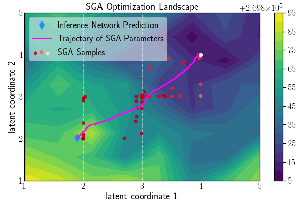

# Improving Inference for Neural Image Compression



This repository contains implementation of various methods considered in [Improving Inference for Neural Image Compression](https://arxiv.org/pdf/2006.04240.pdf),
accepted at NeurIPS 2020:
```
@article{yang2020improving,
  title={Improving Inference for Neural Image Compression},
  author={Yang, Yibo and Bamler, Robert and Mandt, Stephan},
  journal={arXiv preprint arXiv:2006.04240},
  year={2020}
}
```

## Overview
We propose various methods to improve the compression performance of a popular and competitive neural image compression baseline model
(mean-scale hyperprior model proposed by [Minnen et al., 2018](https://arxiv.org/abs/1809.02736)), *at inference/compression time*,
based on ideas related to iterative variational inference, stochastic discrete optimization, and bits-back coding,
aiming to close the approximation gaps that lie between current neural compression methods and rate-distortion optimality.

The scripts `mbt2018.py` (non-bits-back version) and `mbt2018_bb.py` (bits-back version) train the baseline models, with encoder networks
learned through amortized inference. Given trained models, the following scripts run various iterative inference methods considered in the paper
and evaluate the resulting compression performance: `sga.py`, `map.py`, `ste.py`, `unoise.py`, and `danneal.py`
 (requiring a model pre-trained with `mbt2018.py`), and `bb_sga.py`, `bb_no_sga.py`, and `bb_plain.py` (requiring a model pre-trained with `mbt2018_bb.py`).


## Requirements

To install requirements:

```setup
pip install -r requirements.txt
```
The important dependencies are python 3.6 (tested on 3.6.9), tensorflow-compression 1.3 (which requires tensorflow 1.15), and
tensorflow-probability 0.7.0 for the Gumbel-softmax trick (used in Stochastic Gumbel Annealing).


## Training
The following command can be used to train models in the paper:

`python <train_script> --checkpoint_dir <checkpoint_dir> --num_filters <num_filters> train --train_glob=<train_glob>  --batchsize 8 --patchsize 256 --save_summary_secs 600 --lambda <lambda> --last_step <last_step>`


* `<train_script>` is `mbt2018.py` for the Base Hyperprior model in paper, and `mbt2018_bb.py` for the version modified
for lossy bits-back coding;
* `<checkpoint_dir>` is the overall folder of model checkpoints (this is `/.checkpoints` by default);
* `<num_filters>` is the number of (de)convolutional filters; in the paper we set this to 192 for most of our models following [Minnen et al., 2018](https://arxiv.org/abs/1809.02736),
 except we found it necessary to increase this to 256 to match the published performance of mean-scale model at higher rate
 (when `lambda=0.04` and `0.08`), following [Ballé et al., 2018](https://arxiv.org/abs/1802.01436);
* `<train_glob>` is a string of glob pattern like "imgs/*.png" or "imgs/*.npy" (we support float32 `.npy` format to reduce CPU load when training);
in our experiments we used [CLIC-2018](https://www.compression.cc/2018/challenge/) images (specifically, all the images from [professional_train](https://data.vision.ee.ethz.ch/cvl/clic/professional_train.zip),
[professional_valid](https://data.vision.ee.ethz.ch/cvl/clic/professional_valid.zip), [professional_test](https://data.vision.ee.ethz.ch/cvl/clic/test/professional_test.zip), [mobile_valid](https://data.vision.ee.ethz.ch/cvl/clic/mobile_valid.zip),
and [mobile_test](https://data.vision.ee.ethz.ch/cvl/clic/test/mobile_test.zip), with no pre-processing; **UPDATE (10/19/2020)** some of these links seem to have stopped working, so we are providing our copies
[here](https://drive.google.com/drive/folders/1Ofbn11daOLc4MkE1ju_w3SJNI2MP2mhc?usp=sharing));
* `<lambda>` is the penalty in front of the reconstruction loss and controls the rate-distortion tradeoff; see below section on pre-trained models;
* `<last_step>` is the total number of training steps; we typically used 2 million steps
 to reproduce the mean-scale (base hyperprior) model results from [Minnen et al., 2018](https://arxiv.org/abs/1809.02736);
* `batchsize` and `patchsize` are chosen after [Ballé et al., 2018](https://arxiv.org/abs/1802.01436);
 for miscellaneous other options see `tf_boilerplate.py`;


## Inference/Evaluation
Given a pretrained model and some image input, the following command runs some form of (improved) inference method for compression and evaluates the reconstruction results (BPP, PSNR, MS-SSIM, etc.):

`python <script> --num_filters <num_filters> --verbose --checkpoint_dir <checkpoint_dir> compress <run_name> <eval_imgs> --results_dir <results_dir>`

where `<script>` is one of the compression/evaluation scripts listed below, `<num_filters>` (e.g., 192) and `<run_name>` (e.g., `mbt2018-num_filters=192-lmbda=0.001`)
 come from the pre-trained model
 (whose checkpoint folder should belong to `<checkpoint_dir>`), and `<eval_image>` can be either a single input image,
 or a numpy array of a batch of images with shape (num_imgs, H, W, 3) and type uint8.

Below we list the `script` used for all inference methods evaluated in the paper:

| script               | method                         | entry in Table 1 of paper
| -------------------- | ------------------------------ | -------------------------
| mbt2018.py           | Base Hyperprior                | M3
| sga.py     | SGA                            | M1
| bb_sga.py  | SGA + BB                       | M2
| map.py| MAP                            | A1
| ste.py     | STE                            | A2
| unoise.py         | Uniform Noise                  | A3
| danneal.py  | Deterministic Annealing        | A4
| bb_no_sga.py       | BB without SGA                 | A5
| bb_plain.py           | BB without any iterative inference | A6


## Pre-trained Models

Our pretrained models can be found [here](https://drive.google.com/drive/folders/1XXdRz4fMmsRviDy6i0Jdh7raYU7N7sZB).
Download and untar them into `<checkpoint_dir>`, with each folder corresponding to a model `<runname>`.


